<picture>
  <source media="(prefers-color-scheme: dark)" srcset="assets/hero-dark.svg">
  <source media="(prefers-color-scheme: light)" srcset="assets/hero-light.svg">
  
</picture>

Building machine learning tools for recognizing, annotating, and structuring premodern Japanese texts

## Foreground jobs

| Repository | Role | Purpose |
| --- | --- | --- |
| [`kuzushiji-vision`](https://github.com/Kotomiya07/kuzushiji-vision) | RECOGNITION | Kuzushiji recognition with YOLO character localization, language models, and a FastAPI/HTMX inference UI |
| [`kuzushiji-column`](https://github.com/Kotomiya07/kuzushiji-column) | ANNOTATION | Column annotation web app connecting manual correction, model inference, HITL retraining, and dataset updates |
| [`kuzushiji-hf-converter`](https://github.com/Kotomiya07/kuzushiji-hf-converter) | DATA PIPELINE | Data conversion for page- and character-level Hugging Face Datasets plus COCO and YOLO formats |

## Process tree

<picture>
  <source media="(prefers-color-scheme: dark)" srcset="assets/closed-loop-dark.svg">
  <source media="(prefers-color-scheme: light)" srcset="assets/closed-loop-light.svg">
  
</picture>

## Background jobs

<strong>More pinned work</strong> · 2 modules

| Module | Purpose |
| --- | --- |
| [`soan-professional`](https://github.com/Kotomiya07/soan-professional) | TypeScript CLI for reproducibly generating classical and historical Japanese character images with metadata |
| [`kotenseki-annotator-web`](https://github.com/Kotomiya07/kotenseki-annotator-web) | Annotation editor for premodern Japanese book images built with FastAPI, HTMX, and Fabric\.js |

<a href="https://github.com/Kotomiya07">GitHub</a>

<!-- Generated by profile-control-plane. Edit profile.yaml, not this file. -->
