<picture>
  <source media="(prefers-color-scheme: dark)" srcset="assets/hero-dark.svg">
  <source media="(prefers-color-scheme: light)" srcset="assets/hero-light.svg">
  
</picture>

Building machine learning tools for recognizing, annotating, and structuring premodern Japanese texts.

  <picture>
    <source media="(prefers-color-scheme: dark)" srcset="https://github-readme-stats-seven-sigma-13.vercel.app/api?username=Kotomiya07&amp;custom_title=Kotomiya07%27s%20GitHub%20Stats&amp;show_icons=true&amp;include_all_commits=true&amp;hide_border=true&amp;title_color=58A6FF&amp;text_color=C9D1D9&amp;icon_color=58A6FF&amp;bg_color=0D1117">
    <source media="(prefers-color-scheme: light)" srcset="https://github-readme-stats-seven-sigma-13.vercel.app/api?username=Kotomiya07&amp;custom_title=Kotomiya07%27s%20GitHub%20Stats&amp;show_icons=true&amp;include_all_commits=true&amp;hide_border=true&amp;title_color=0969DA&amp;text_color=1F2328&amp;icon_color=0969DA&amp;bg_color=FFFFFF">
    
  </picture>

<!-- Generated by profile-control-plane. Edit profile.yaml and scripts/simplify-readme.py, not this file. -->
